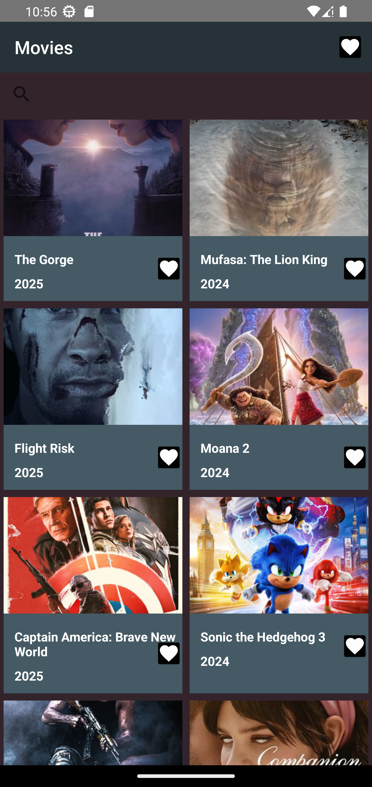
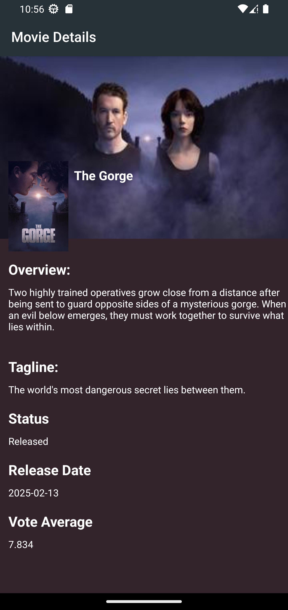

# TMDB
This is an android application that shows Lists of movies details of each movie 
with the help of TMDB (The Movie DataBase) API.

## Features
- Discover Popular movies on TMDb.
- View movie details like release date, rating, tagline and overview inside the app.
- view Fav Movies details like release date, rating, tagline and overview inside the app.

## Architecture and Tech features
- Written in Kotlin language.
- Built on MVVM architecture pattern.
- Uses Android Architecture Components, specifically ViewModel and LiveData.
- Uses Retrofit for making API calls.
- Uses Picasso for image loading.

## Screenshots

## TODO
- [ ] Works Unit Testing.
